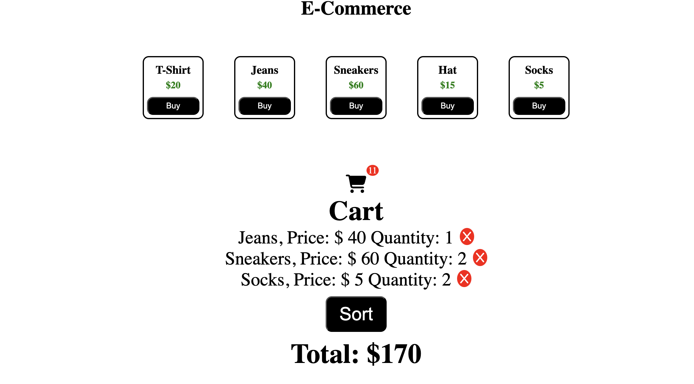

# Simple-E-Commerce-Cart
We created a page where users can add shopping items, view the items they've added to the cart, see the quantity of each item, check the total price, remove items from the cart, and sort items in the cart by name.



## Prerequisites
- A web browser (Chrome, Brave, Firefox, etc.)
- Visual Studio Code
- A basic understanding of Javascript, HTML, CSS and React

## How to Access it
1. Open your Terminal and clone this repository
- `git clone https://github.com/**your github username**/Simple-E-Commerce-Cart`

2. Move into the directory
- `cd Simple-E-Commerce-Cart/`

3. Open it in VSCode
- `code .`

## Adding Items to the Cart
This was achieved by implementing state to keep track of the items in the cart and updating the quantity of each item accordingly
```Javascript
  const [cart, setCart] = useState([]);
  setCart((cart) => {
            const existingProduct = cart.find((item) => item.id === product.id);
            if (existingProduct) {
                return cart.map((item) =>
                    item.id === product.id
                        ? { ...item, quantity: item.quantity + 1 }
                        : item
                );
            } else {
                return [...cart, { ...product, quantity: 1 }];
            }
        });
```
## Checking the Total Price
State was also used to track and update the total price of the items in the cart. We implemented a callback function within the state to take the previous total and add the price of the product.
```Javascript
  const [total, setTotal] = useState(0)
  setTotal((prevTotal) => prevTotal + product.price);
```
## Removing Items From the Cart
To remove items from the cart, we first decrease the quantity of each item by 1 every time a user clicks the close icon. Once the quantity reaches 0, the item is then removed from the cart.
```Javascript
function removeItem(id) {
        const updatedData = cart
                .map(item => { //We had to first remove the quantity of the item before removing it in the cart
                    if (item.id === id) {
                        setTotal((prevTotal)=>prevTotal-item.price)
                    return { ...item, quantity: item.quantity - 1 }; // Reduce quantity by 1
                    }
                    return item;
                })
                .filter(item => item.quantity > 0); // Remove items with quantity <= 0

                setCart(updatedData)
    }
```
## Sort items in the cart
First, we created a shallow copy of the cart items, then used the sort functionality to arrange the items in ascending order by name.
```Javascript
function sortItems() {
        const sortedCart = [...cart].sort((item1, item2) => item1.name.localeCompare(item2.name));
        setCart(sortedCart);
    }  
```